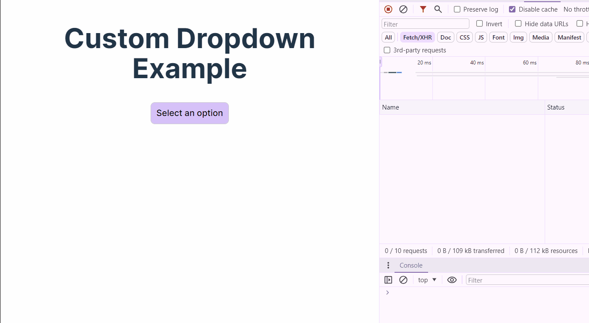

# React + TypeScript + Vite

## Features
Custom dropDown with virtualization




This template provides a minimal setup to get React working in Vite with HMR and some ESLint rules.

Currently, two official plugins are available:

- [@vitejs/plugin-react](https://github.com/vitejs/vite-plugin-react/blob/main/packages/plugin-react/README.md) uses [Babel](https://babeljs.io/) for Fast Refresh
- [@vitejs/plugin-react-swc](https://github.com/vitejs/vite-plugin-react-swc) uses [SWC](https://swc.rs/) for Fast Refresh


## Installation

You can install the dependencies and set up the project using either npm or Yarn. It is recommended to use Yarn for consistency with the existing setup.

### Using Yarn (recommended)

To install with Yarn, run the following command:

```yarn install```
or 
```npm i```

### Running the Application

To start the application in development mode with hot reloading, use:

```yarn start```

### Building the Application

To build the application for production:

```yarn build```


